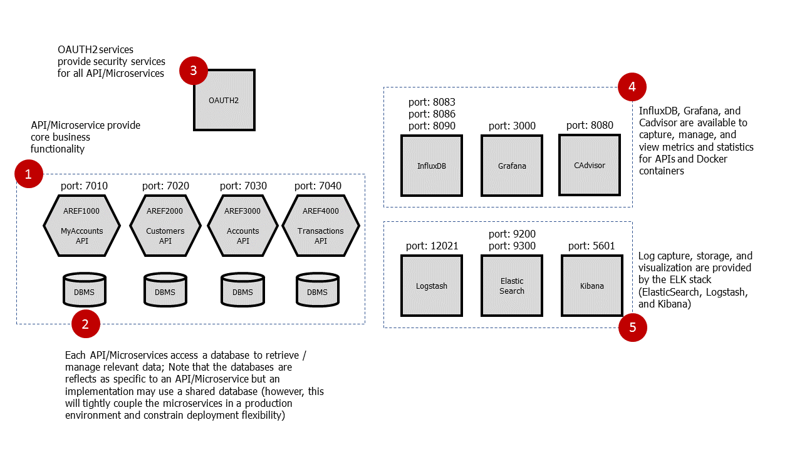

# Reference Application - Training Material
## Building REST APIs

The API Platform provides a secure, resilient, and flexible method of
developing, packaging, and deploying APIs.  The platform supports
microservice development using Java and Node.js while providing a set of
consistent capabilities which dramatically accelerate API delivery:
- generation of runnable APIs from Swagger specifications delivered with
mock data and unit test cases
- embedded security (for each generated Microservice) supporting OAUTH2
- request validation against the Swagger specification parameters and URI
- embedded logging
- embedded metrics capture
- packaging of APIs/microservices in Docker containers
- a comprehensive set of documentation including a "Getting Started" guide as
well as User Guides for major components
- a full Reference Application which demonstrates the aforementioned capabilities
while also serving as a template for efficiently and effectively
building APIs

This set of documents describes how to use the API Platform by taking the reader through
a step-by-step set of tutorials by building the reference application.  Upon completion
of these tutorials the reader should be able to:
- build APIs using the API Platform components
- configure APIs to take advantage of out-of-the-box security,
manageability, and monitoring capability
- package the APIs into a Docker container
- use industry leading dashboards to visualize metrics, performance data and logs

API Platform microservices are packaged as Docker images and hence
can be deployed in Docker containers using a number of deployment environments including Docker Compose,
Docker Swarm, and Kubernetes.  

This tutorial will initially deploy APIs in
a docker-compose environment suitable for developers and then demonstrate
deployment to Kubernetes as a follow-up.

For the purposes of this document, *"API"* and *"microservices"* are used interchangable.
It is recognized, however, that APIs generally address its specification or contract
(URI/URL, request, and response) and microservices are an implementation method
for APIs.  The API Platform in particular uses Swagger specifications to fully
define an API contract and microservices to implement the API specification.

## Audience

This particular tutorial is targeted at developers who will be building REST APIs.

However, it is expected that a number of other parties stand to benefit
from completing the tutorial including:
- architects, who will be able to use this information to design and create
blueprints required to support enterprise deployments of APIs
- engineers, who will be able to understand deployment considerations required
to design effective and resilient operating environments for APIs

## Prerequisites

The reference application is designed to work in all major environments, however,
many of the underlying components, including docker, run optimally in MacOS
and Linux.  At times components do not work as expected under Windows and hence
it is recommended that developers focus on MacOS or Linux when using the reference
application.

A number of tools are required to use this tutorial:
- Docker  
- Java 8
- Maven

Docker is a "container" technology which allows APIs
as well as supporting components to be easily packaged and deployed.  Docker
is used extensively by the reference application and hence must be installed
to complete this tutorial.  Docker installation instructions are available
[from the official Docker site](https://docs.docker.com/engine/installation/)

While the API Platform supports both Java, version 8 and up, as well as node.js, the
reference application uses Java.  Instructions to install Java
can be found [on the Oracle Java page](http://www.oracle.com/technetwork/java/javase/downloads/jdk8-downloads-2133151.html).

Maven is used to build Java APIs.  Installation Instructions
for Maven can be found [on the official Maven site](http://maven.apache.org/install.html)

Several of the build steps use Linux utilities which may not be available
on MacOS.  If MacOS is being used then install "core utilities" by typing
the following in a terminal window:

```
    brew update
    brew install coreutils
```    

While instructions for the reference application are made to be easy to follow,
it is strongly recommended that the developer has basic skills and experience
in the following technologies:
- Docker and DockerHub
- Git / Github
- Java 8
- Maven

In addition, several steps in the tutorial use a database and hence a basic
level of understanding of SQL is expected.  The reference application is
built using Oracle but can easily be modified to use other databases
such as Postgres, MySQL as well as other popular databases.

## Reference Application Architecture

For the purposes of this document, *"API"* and *"microservices"* are interchangable.
It is recognized, however, that APIs generally address its specification or contract
(URI/URL, request, and response) and microservices are an implementation method
for APIs.  The API Platform in particular uses Swagger specifications to fully
define an API contract and microservices to implement the API specification.

The reference APIs demonstrates a common scenario where a mobile
customer views his/her portfolio. The initial request is sent to the
MyAccounts APIs which acts as an aggregator API.  MyAccounts aggregates
data from the Customers, Accounts and Transactions APIs.  MyAccounts retrieves
customer data from the Customer API, uses the customer's ID to access the
Accounts API and retrieve account information for the customer.  For each
account, MyAccounts accesses the Transactions API to retrieve transaction
data associated to each account.  Each microservice returns its data to the
calling MyAccounts microservice, which ultimately aggregates the information
and returns it to the mobile customer.


The following REST APIs will be built and deployed in this tutorial:
- myaccounts: Reference Application MyAccounts API
- customers: Reference Application Customers API
- accounts: Reference Application Accounts API
- transacts: Reference Application Transactions API

The software architecture of typical application with the aforementioned
components is illustrated below.



In addition, a production-like deployment -- specifically, one that is
representative of a production environment, but not exactly the same -- is
illustrated below.  Something quite similar to this is available to you
when a number of the API reference components are deployed.


## The API Platform Reference Components

As stated earlier, our objective in our training exercises is to demonstrate
end-to-end API capabilities.  For your convenience, the reference components
are available externally in the [CIBC API GitHub Organization](https://github.com/cibc-api/) or internally in [Enterprise GitHub](https://github.cibcdevops.com)
in the following repos:
- Externally [reference-rest-api](https://github.com/cibc-api/reference-rest-api):  tutorial to build REST APIs
- Internally [apif-developer-training-rest](https://github.cibcdevops.com/CIBC/apif-developer-training-rest):  tutorial to build REST APIs

## Currently supported versions

- Java 8
- Light-4J framework: 1.5.21
- Light-rest-4J framework: 1.5.21

## Designing, Building, and Testing REST APIs - step-by-step

- [Step 1:  Reference Application Setup: training materials and database](doc/step-01.md)
- [Step 2:  Creating Swagger Specifications](doc/step-02.md)
- [Step 3:  Customers API - from code generation to Docker composition](doc/step-03.md)
  * [Step 3.1:  Generating the Customers API code](doc/step-03.md)  
  * [Step 3.2:  Adding a Database Query to the Customers API implementation](doc/step-0.3.2.md)
  * [Step 3.3:  Creating Docker Compose Files (API, respectively Database)](doc/step-0.3.3.md)
  * [Step 3.4:  Functional and Load Testing an API](doc/step-0.3.4.md)
- [Step 4:  API-to-API calls: Customers API calling the Accounts API](doc/step-04.md)
- [Step 5:  The MyPortfolio Reference Application: Integrating the MyAccounts, Customers, Accounts and Transactions APIs](doc/step-05.md)
- [Step 6:  Hands-On Excercise - Document Swagger and implement code for Preference API ](doc/step-06.md)

## Building and Testing the complete REST Reference Application in One Step

- [One-step Build and Test: Reference Application](doc/one-step.md)
