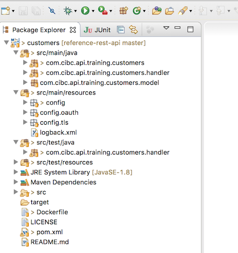

# Chapter 3:  Customers API - from code generation to Docker composition

Chapter 3 of the tutorial will illustrate how to:
* [3.1]
  * Create API code generation configuration files
  * Generate the API implementation code
  * Run the generated microservice and test the API
  * Opening the Generated Code in the Eclipse IDE
* [3.2]
  * Add a database query to the microservice
* [3.3]
  * Create Docker Compose files, to start the microservice as a Docker image with external configuration
* [3.4]
  * Functional and Load Testing an API

## Instructions

You may continue where you have left off from the previous step, or you can
execute his tutorial with the required modules for chapter 3 (a clean version of the reference training
application from the *end* of chapter 2).  To execute this, type the following (from the __*/utl*__ folder). :

```bash
    # reset the training
    :> cd utl
    <reference-training root>/utl:> ./reset-training.sh

    # set up the Swagger definitions
    <reference-training root>/utl:> ./train.sh swagger
```

The Swagger definitions will be available locally in the swagger sub-folder of the root of the reference application.

# Chapter 3.1

## Code generator setup
The API code generator is based on the __light-codegen__ code generator provided by the Networknt team and updated with artifacts specific to the API Foundation components.

The code generator code is available in the [__*light-codegen*__](https://github.com/networknt/light-codegen) repository and will be used as a Docker image, available in Dockerhub in the https://hub.docker.com/r/networknt/light-codegen/ repository.

For your convenience, a number of utility scripts have been provided in the /utl folder:

```bash
  # pull the Docker image for the light code generator
  :> docker pull networknt/light-codegen:1.5.21

  # remove the code generator from the /utl/light-codegen folder
  <reference-training root>/utl:> ./clean-generator.sh
```

## If the above docker pull command fails...

The docker image for light-codegen is not always available from the opensource repository. In the event that you get an error from the docker pull command above, there is a jar of codegen-cli in the utl directory. You may use this instead of the generate.sh commands below.

## Create API Code Generation Configuration Files

The first step in creating a new API is to provide the
configuration information used to generate the API.  Several
files/directories are required:
- config.json:  configuration file to generate the API implementation code
- swagger.json: the API Swagger specification (JSON format)

The code generation configuration file, config.json, describes code components for
an API.

The following is an example of the configuration file to generate
the Customers API:

```
{
	"name": "customers",
	"version": "1.00.00",
	"groupId": "training",
	"artifactId": "customers",
	"rootPackage": "com.cibc.api.training.customers",
	"handlerPackage":"com.cibc.api.training.customers.handler",
	"modelPackage":"com.cibc.api.training.customers.model",
	"overwriteHandler": true,
	"overwriteHandlerTest": true,
	"overwriteModel": true,
	"httpPort": 7020,
	"enableHttp": false,
	"httpsPort": 8453,
	"enableHttps": true,
	"enableRegistry": false,
	"supportDb": true,
	  "dbInfo": {
	    "name": "oracle",
	    "driverClassName": "oracle.jdbc.pool.OracleDataSource",
	    "jdbcUrl": "jdbc:oracle:thin:@localhost:1521:XE",
	    "username": "SYSTEM",
	    "password": "oracle"
	  },
	  "supportH2ForTest": true,
	  "supportClient": true
}

# where:
# name:             used in generated pom.xml for project name
# version:          used in generated pom.xml for project version
# groupId:          used in generated pom.xml for project groupId
# artifactId:       used in generated pom.xml for project artifactId
# rootPackage:      the root package name for your project and it will normally be your domain plug project name.
# handlerPackage:   the Java package for all generated handlers.
# modelPackage:     the Java package for all generated models or POJOs.
# overwriteHandler: controls if you want to overwrite handler when regenerate the same project into the same folder.
#                   If you only want to upgrade the framework to another minor version and don't want to overwrite handlers, then set this property to false.
# overwriteHandlerTest: controls if you want to overwrite handler test cases.
# overwriteModel:       controls if you want to overwrite generated models.
# httpPort:             the port number of Http listener if enableHttp is true.
# enableHttp:           specify if the server listens to http port. Http should only be enabled in dev.
# httpsPort:            the port number of Https listener if enableHttps is true.
# enableHttps:          specify if the server listens to https port. Https should be used in any official environment for security reason.
# enableRegistry:       control if built-in service registry/discovery is used. Only necessary if running as standalone java -jar xxx.
# supportOracle:        if true, add Oracle JDBC client in pom.xml dependencies and add service.yml to connect Oracle during server startup.
# supportMysql:         if true, add Mysql JDBC client in pom.xml dependencies and add service.yml to connect Mysql during server startup.
# supportPostgresql:    if true, add Postgresql JDBC client in pom.xml dependencies and add service.yml to connect to Postgresql during server startup.
# supportH2ForTest:     if true, add H2 in pom.xml as test scope to support unit test with H2 database.
# supportClient:        if true, add com.networknt.client module to pom.xml to support service to service call.
```

## Generate the API code

The following steps are required to generate the API:

#### Step 1:  Create a configuration file

In the __*/swagger*__ folder, for each API built in the reference training, create and edit a config.json file:

##### MyAccounts API

```
{
	"name": "myaccounts",
	"version": "1.00.00",
	"groupId": "training",
	"artifactId": "myaccounts",
	"rootPackage": "com.cibc.api.training.myaccounts",
	"handlerPackage":"com.cibc.api.training.myaccounts.handler",
	"modelPackage":"com.cibc.api.training.myaccounts.model",
	"overwriteHandler": true,
	"overwriteHandlerTest": true,
	"overwriteModel": true,
	"httpPort": 7010,
	"enableHttp": false,
	"httpsPort": 8443,
	"enableHttps": true,
	"enableRegistry": false,
	"supportDb": true,
	  "dbInfo": {
	    "name": "oracle",
	    "driverClassName": "oracle.jdbc.pool.OracleDataSource",
	    "jdbcUrl": "jdbc:oracle:thin:@localhost:1521:XE",
	    "username": "SYSTEM",
	    "password": "oracle"
	  },
	  "supportH2ForTest": true,
	  "supportClient": true
}
```

##### Customers API

```  
{
	"name": "customers",
	"version": "1.00.00",
	"groupId": "training",
	"artifactId": "customers",
	"rootPackage": "com.cibc.api.training.customers",
	"handlerPackage":"com.cibc.api.training.customers.handler",
	"modelPackage":"com.cibc.api.training.customers.model",
	"overwriteHandler": true,
	"overwriteHandlerTest": true,
	"overwriteModel": true,
	"httpPort": 7020,
	"enableHttp": false,
	"httpsPort": 8453,
	"enableHttps": true,
	"enableRegistry": false,
	"supportDb": true,
	  "dbInfo": {
	    "name": "oracle",
	    "driverClassName": "oracle.jdbc.pool.OracleDataSource",
	    "jdbcUrl": "jdbc:oracle:thin:@localhost:1521:XE",
	    "username": "SYSTEM",
	    "password": "oracle"
	  },
	  "supportH2ForTest": true,
	  "supportClient": true
}
```

##### Accounts API

```
{
	"name": "accounts",
	"version": "1.00.00",
	"groupId": "training",
	"artifactId": "accounts",
	"rootPackage": "com.cibc.api.training.accounts",
	"handlerPackage":"com.cibc.api.training.accounts.handler",
	"modelPackage":"com.cibc.api.training.accounts.model",
	"overwriteHandler": true,
	"overwriteHandlerTest": true,
	"overwriteModel": true,
	"httpPort": 7030,
	"enableHttp": false,
	"httpsPort": 8463,
	"enableHttps": true,
	"enableRegistry": false,
	"supportDb": true,
	  "dbInfo": {
	    "name": "oracle",
	    "driverClassName": "oracle.jdbc.pool.OracleDataSource",
	    "jdbcUrl": "jdbc:oracle:thin:@localhost:1521:XE",
	    "username": "SYSTEM",
	    "password": "oracle"
	  },
	  "supportH2ForTest": true,
	  "supportClient": true
}
```

##### Transacts API

```
{
	"name": "transacts",
	"version": "1.00.00",
	"groupId": "training",
	"artifactId": "transacts",
	"rootPackage": "com.cibc.api.training.transacts",
	"handlerPackage":"com.cibc.api.training.transacts.handler",
	"modelPackage":"com.cibc.api.training.transacts.model",
	"overwriteHandler": true,
	"overwriteHandlerTest": true,
	"overwriteModel": true,
	"httpPort": 7040,
	"enableHttp": false,
	"httpsPort": 8473,
	"enableHttps": true,
	"enableRegistry": false,
	"supportDb": true,
	  "dbInfo": {
	    "name": "oracle",
	    "driverClassName": "oracle.jdbc.pool.OracleDataSource",
	    "jdbcUrl": "jdbc:oracle:thin:@localhost:1521:XE",
	    "username": "SYSTEM",
	    "password": "oracle"
	  },
	  "supportH2ForTest": true,
	  "supportClient": true
}
```

#### Step 2:  Inspect the swagger.yaml file with the Swagger editor

Inspect the four APIs required for the reference training, located in the __*/swagger*__ folder.

The individual API definition folders will contain two files: config.json and swagger.yaml.
While we recommend using YAML files, for legibility, we can use JSON-formatted files in an idempotent manner.

*Note*: the Swagger code generator uses JSON files. To transform Swagger YAML files into Swagger JSON files, all you need to do is navigate to the *File-->Download JSON* menu item and save the file. Similarly, use *File-->Download YAML* for the inverse operation.

#### Step 3:  Generate the API implementation code

The API code can be created by opening a terminal window,
changing to the reference application's __*/utl*__ folder, and
executing the following command:

```bash
  :> ./generate.sh  <light framework to generate the project for>
                    <absolute path to swagger.json and config.json folder>
                    <absolute path to API code output folder>

  # Ex.:
  # To generate the Customers API implementation code:
  :> ./generate.sh light-rest-4j  ~/work/cibc-api/branches/reference-rest-api/swagger/customers ~/work/cibc-api/branches/reference-rest-api/customers

  # The same steps need to be repeated for the remaining APIs !

  # MyAccounts API
  :> ./generate.sh light-rest-4j ~/work/cibc-api/branches/reference-rest-api/swagger/myaccounts ~/work/cibc-api/branches/reference-rest-api/myaccounts

  # Accounts API
  :> ./generate.sh light-rest-4j ~/work/cibc-api/branches/reference-rest-api/swagger/accounts ~/work/cibc-api/branches/reference-rest-api/accounts

  # Transacts API
  :> ./generate.sh light-rest-4j ~/work/cibc-api/branches/reference-rest-api/swagger/transacts ~/work/cibc-api/branches/reference-rest-api/transacts
```

### Again, in the event that you don't have a docker image for light-codegen...

You can also use the following commands to generate using codegen-cli.jar

```bash
  # <reference-training root>/utl:>  java -jar codegen-cli.jar -f swagger -o <absolute path to API code output folder> -m <absolute path to swagger.json> -c <absolute path to config.json> 
  
  # Ex.:
  # To generate the Customers API implementation code:
  <reference-training root>/utl:>  java -jar codegen-cli.jar -f swagger -o ../customers -m ~/Code/public_github/cibc-api/reference-rest-api/swagger/customers/swagger.json -c ~/Code/public_github/cibc-api/reference-rest-api/swagger/customers/config.json 

  # The same steps need to be repeated for the remaining APIs !

  # MyAccounts API
  <reference-training root>/utl:>  java -jar codegen-cli.jar -f swagger -o ../myaccounts -m ~/Code/public_github/cibc-api/reference-rest-api/swagger/myaccounts/swagger.json -c ~/Code/public_github/cibc-api/reference-rest-api/swagger/myaccounts/config.json 

  # Accounts API
  <reference-training root>/utl:>  java -jar codegen-cli.jar -f swagger -o ../accounts -m ~/Code/public_github/cibc-api/reference-rest-api/swagger/accounts/swagger.json -c ~/Code/public_github/cibc-api/reference-rest-api/swagger/accounts/config.json 

  # Transacts API
  <reference-training root>/utl:>  java -jar codegen-cli.jar -f swagger -o ../transacts -m ~/Code/public_github/cibc-api/reference-rest-api/swagger/transacts/swagger.json -c ~/Code/public_github/cibc-api/reference-rest-api/swagger/transacts/config.json 
```

Output similar to the following will be shown on your terminal (only a subset
of the output is shown below):

```bash
  <reference-training root>/utl:>  ./generate.sh light-rest-4j ~/work/cibc-api/branches/reference-rest-api/swagger/customers ~/work/cibc-api/branches/reference-rest-api/customers

  INFO: Generating project, using:
      - framework: light-rest-4j
      - input-dir: <reference-training root>/swagger/customers
      - output-dir: <reference-training root>/customers

  INFO: Running: networknt/light-codegen light-rest-4j /light-api/input/swagger.json /light-api/input/config.json /light-api/out17:52:22.264 [main] INFO com.fizzed.rocker.runtime.RockerRuntime - Rocker version 0.16.0
  17:52:22.270 [main] INFO com.fizzed.rocker.runtime.RockerRuntime - Rocker template reloading not activated

  Code generation is complete
```

After completion, this  command will create a freshly generated API implementation.

The contents of this folder will contain a number of files
including the following files:

- Dockerfile: The API Docker file used to create docker image for the API
- README.md: Basic information and instructions for the API
- pom.xml:  The Maven build file
- LICENSE:  Licensing for the API and dependent products
- dependency-reduced-pom.xml: A maven build file
- src:  The source code folder for the API
- src/main/resources/config: swagger.json updated to automatically include an additional endpoint for healthchecks: /v1/health

## Opening the Generated Code in the Eclipse IDE

The folder also includes .project file that can be used to open the generated code in IDE, such as Eclipse.

Step 1: In Package Explorer view select Import


Step 2: Select 'Existing Project into Workspace'


Step 3: Use 'Browse' to select folder with the generated code e.g. customers


The folder with generated code will open in Package Explorer view of the IDE




## Build the API code

At this time, the API code needs to be built using the generated Maven pom.xml build file.

Navigate to the API code folder and build using Maven:

>Please note: When using light-4j v1.5 and above, OpenJDK v8.0 and above is supported. If utilizing light-4j v2 and above, OpenJDK 8 and 11 is supported. 

```bash
  # Customers API
  :> cd ../customers
  :> mvn clean install

  # Repeat for each of the remaining APIs !
  /myaccounts
  /accounts
  /transacts
```

## Run the API

The generated API has an executable __*customers-1.00.00.jar*__ executable file in the __*/target*__ folder.

The executable can now be run to validate that it works. To run the API,
change the folder to the <API> folder and run the executable:

```bash
    cd ../customers
    java -jar ./target/customers-1.00.00.jar

    # Alternatively, you can build with a script provided in the /utl folder
    cd <training-root folder>/utl
    <reference-training root>/utl:> ./build.sh mvn customers

    # alternatively, start from the API folder and run Maven with
    :> mvn clean install exec:exec

    # Stop the process using a <Control>+C command !

    # Similar operations have to be repeated for the remaining APIs in this training
    /myaccounts
    /accounts
    /transacts
```

## Test the API

The default port configurations for a generated API are defined in the config.json file of the respective API.  

Ex.: config.json for the Customers API
```
  {
  	"name": "customers",
  	"version": "1.00.00",
    ...
  	"httpPort": 7020,
  	"enableHttp": false,
  	"httpsPort": 8453,
  	"enableHttps": true,
    ...
```

The https ports are enabled in the Docker compose file. To test with https, please issue the following "curl" commands.

Please note that the "-k" option is enabled.
(TLS) By default, every SSL connection curl makes is verified to be secure. This option allows curl to proceed and operate even for server connections otherwise considered insecure.

```bash
  # HTTPS Testing

  # TEST the MyAccounts API  

  # retrieve the portfolio for customer with ID 1
  :> curl -k https://localhost:8443/v1/myaccounts/1

  # TEST the Customers API

  # retrieve customer data for customer with ID 1
  :> curl -k https://localhost:8453/v1/customers/1
  # retrieve the accounts associated with the customer with ID 1
  :> curl -k https://localhost:8453/v1/customers/1/accounts

  # TEST the Accounts API

  # retrieve the accounts data for account with ID 1
  :> curl -k https://localhost:8463/v1/accounts/1
  # retrieve the accounts associated with the customer with ID 1
  :> curl -k https://localhost:8463/v1/accounts?cust_id=1
  # retrieve the transactions associated with the account with ID 1
  :> curl -k https://localhost:8463/v1/accounts/1/transactions

  # TEST the Transacts API

  # retrieve the transactions with ID 1
  :> curl -k https://localhost:8473/v1/transactions/1
  # retrieve the transactions associated with the account with ID 1
  :> curl -k https://localhost:8473/v1/transactions?account_id=1  
```

A successful response will appear on your terminal containing the text:

```
  # MyAccounts API response with mock data
  {
    # empty response
  }

  # Customers API
  {
    # empty response
  }

  # Accounts API
  {
    # empty response
  }

  # Transacts API
  {
    # empty response
  }
```

At this point, you now have a working API.  

**The next step** in the tutorial is to connect
the API to a database and make queries to retrieve data.

## Continue to the next chapter

The next chapter is __[Adding a Database Query to the Customers API implementation](step-0.3.2.md)__.
